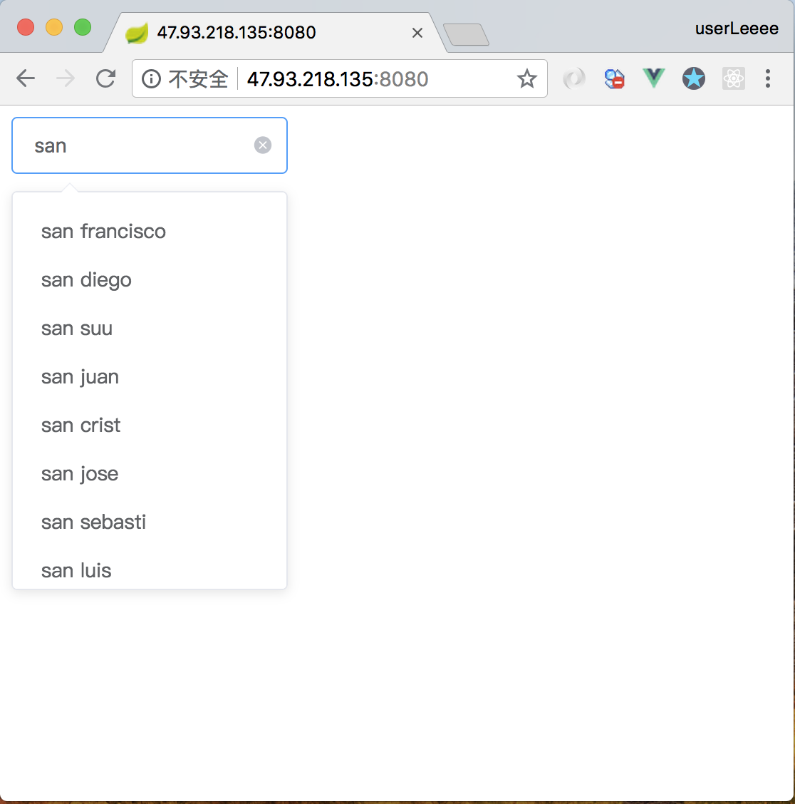

# ac-web
web of auto-complete，实现了一个非常非常非常简易的restful服务器，利用了dao的思想，可能设计的确实太复杂，速度很慢，用hbase也不如mysql，主要为了学习hbase和hadoop相关生态
进行了简略的单元测试
#### 安装
git clone https://github.com/walio/ac-web.git
cd ac-web
mvn install
#### 快速开始
cd target
java -jar ngram-0.0.1-SNAPSHOT.jar
#### 截图

#### 流程
1. 首先根据input查找habse有无对应的history，找不到则回退，确定最终的backoffhistory
2. 对高阶和低阶概率进行归s并排序，其中低阶概率需要乘以对应的lambda